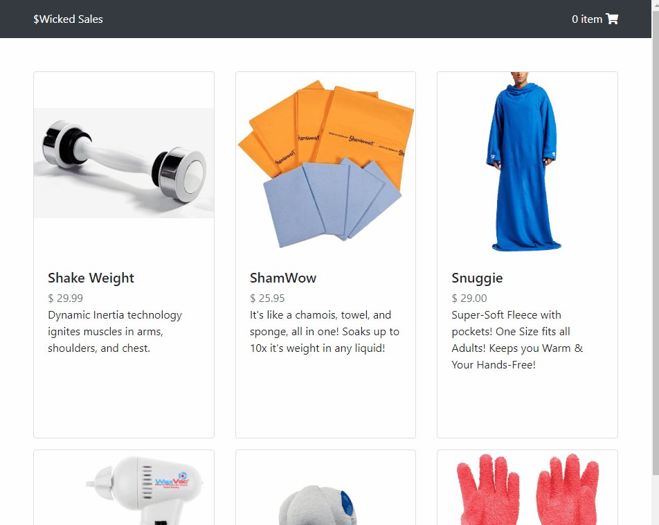

# PPE Agora
A full stack Node.js and React.js shopping app containing two separate storefronts. PPE Agora, a store demo showcasing bootstrap layouts and Personal Protection Equipment products with shopping cart and check out capability. Murican Dream, a store demo for fun where users can simulate the murican dream via virtual consumption

## Technologies Used
|             Dependency             |   Version   |
|------------------------------------|------------:|
| @Babel/Core                        |    7.8.7    |
| @Babel/Plugin-Transform-React-JSX  |    7.8.3    |
| Babel-Loader                       |    8.0.6    |
| Bootstrap                          |    4.3.1    |
| Dotenv                             |    8.2.0    |
| Express                            |    4.17.1   |
| Express-Session                    |    1.17.0   |
| FontAwesome                        |    5.11.2   |
| Node Postgres                      |    7.18.2   |
| PM2                                |    4.2.3    |
| Prop-Types                         |   15.7.2    |
| React                              |   16.13.0   |
| React-DOM                          |   16.13.0   |
| React-Router-DOM                   |    5.1.2    |
| SASS                               |    1.26.9   |
| Session-File-Store                 |    1.4.0    |
| Webpack                            |    4.42.0   |
| Webpack-CLI                        |    3.3.11   |
## Live Demo
[PPE Agora](https://ppe-agora.jackmchou.com/)
## Features
- User can navigate between the two store fronts
- User can view the products for sale
- User can view the details of a product
- User can add a product to the shopping cart
- User can adjust quantity of products
- User can view the cart summary of all the items added to see the total price
- User can delete an item from the cart summary
- User can place an order
## Preview

## Development
#### System Requirements
|   Requirement   |     Version      |
|-----------------|-----------------:|
| Nginx           |  1.10 or higher  |
| Node            |   10 or higher   |
| NPM             |    6 or higher   |
| PM2             |    4 or higher   |
| PostgreSQL      |   10 or higher   |
#### Getting Started
1. Clone the repository
  ```shell
  git clone https://github.com/jackmchou/murican-dream.git
  ```
2. Change directory to cloned folder
  ```shell
  cd murican-dream/
  ```
3. Install all dependencies with NPM
  ```shell
  npm install
  ```
4. Start PostgreSQL server
  ```shell
  sudo service postgresql start
  ```
5. Create the database
  ```shell
  createdb muricanDream
  ```
6. Import the example database to PostgreSQL
  ```shell
  npm db:import
  ```
7. Start the project. Once started you can view the application by opening http://localhost:3000 in your browser.
  ```shell
  npm run dev
  ```